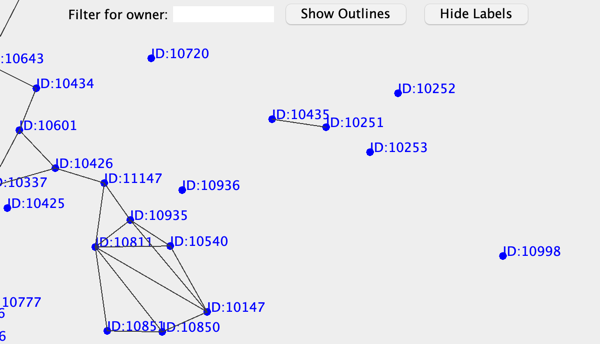
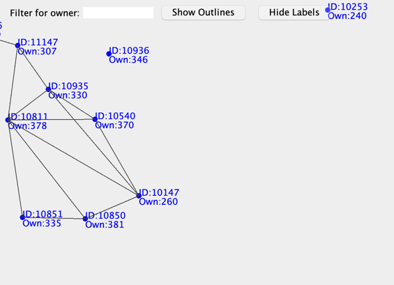
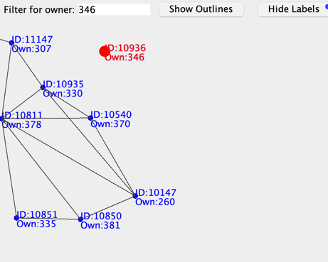
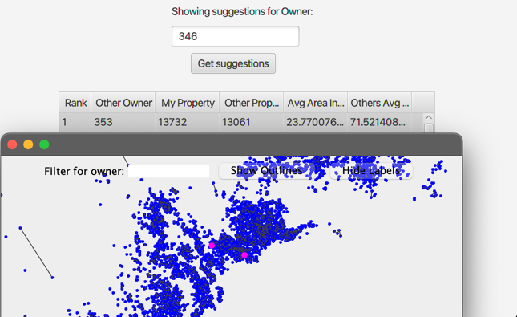

# Software engineering project
## Group A

- Jan Tacakiewicz 128094 https://github.com/Epim3dium
- Miguel Raamsdonk 110722 https://github.com/magvr78290
- Gonçalo Moreira Pires 111259 https://github.com/gmp08
- Joel Matos 111679 https://github.com/JMaxtos

### Visualizer
we added an additional visualizer functionality that is defined in the main GUI menu as Structure 1.
There every node is blue color and represents each distinct property, after zooming in the property id
should become visible.   
Each black line represents a neighbourhood relation between two properties. After zooming in even more
the owner ID of each property will be visible.  
#### GUI:
 * If we want to see each property border we can toggle 'Show outlines'
 * If the user finds the ID: and Own: labels intrusive it's also togglable with 'Hide Labels'
 * If the user want's to highlight specific Owners properties, they can input owner ID in 'Filter for owner:'
field and press enter. Then all of this owners' properties will be highlighted with different color:
#### Suggestions
Visualizer is also used in the suggestions tab. After clicking on specific suggestion row, both of properties that are considered
in this exchange will be highlighted (Magenta color) in new Visuzalizer window.
